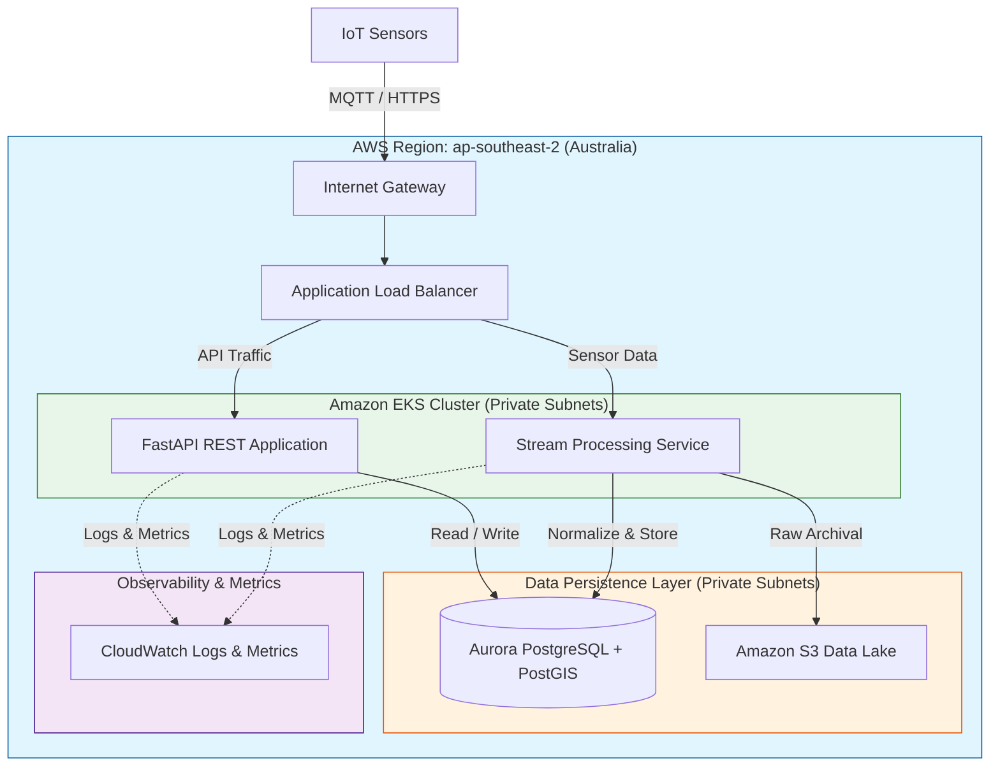

# MVP Architecture Overview

This document outlines the proposed **Minimum Viable Product (MVP)** architecture for the Geospatial Traffic Management Platform.
To build confidence and accelerate the delivery of the "Sensor to Insight" value chain, the MVP focuses on a single-tenant deployment in a single AWS Region.

## High-Level Architecture (MVP Scope)

The platform is designed to be a scalable, reproducible AWS environment for ingesting, processing, and serving geospatial traffic data.

### Core Components

1. **VPC (Virtual Private Cloud)**
    - Secure network isolation with Public and Private subnets across multiple Availability Zones in `ap-southeast-2` (Sydney).
    - [Internet Gateway](terraform/vpc.tf) for public access (ALB).
    - [NAT Gateway](terraform/vpc.tf) (one instance) for private subnets to access the internet.

2. **Compute Layer**
    - **EKS (Elastic Kubernetes Service)**: Version 1.29 cluster ([eks.tf](terraform/eks.tf)) orchestrating `t3.medium` worker nodes in private subnets.
    - **Node Groups**: Managed node groups with auto-scaling to handle API and stream processing workloads.

3. **Data Storage**
    - **RDS (Relational Database Service)**: PostgreSQL 16.1 instance ([rds.tf](terraform/rds.tf)) using `db.t3.medium` and `gp3` storage.
    - **PostGIS**: Provisioned within RDS for geospatial processing.
    - **S3 Data Lake**: Versioned and encrypted bucket ([s3.tf](terraform/s3.tf)) for raw logs and historical data.

4. **Traffic Management & Ingestion**
    - **Application Load Balancer (ALB)**: Handles ingress traffic to the REST APIs.
    - **IoT Ingestion**: Basic MQTT broker to process incoming sensor streams.

## MVP Architecture Diagram

## Implementation Details & Verification

- **Alignment**: This documentation matches the current Terraform configuration in the `terraform/` directory.
- **MVP Scope**: This architecture intentionally omits global routing (Route 53), multi-tenancy (Cognito), and cross-region replication to prioritize speed of delivery and core value proving.
- **Security**: RDS is isolated in private subnets with a security group allowing ingress only from the VPC CIDR (port 5432).
- **Public Access**: EKS endpoint is publicly accessible for administration, while worker nodes remain in private subnets.

*Note: For the future Global Multi-Tenant Architecture (AWS Control Tower, Cross-Region, Edge Outposts), refer to roadmap planning post-MVP delivery.*
