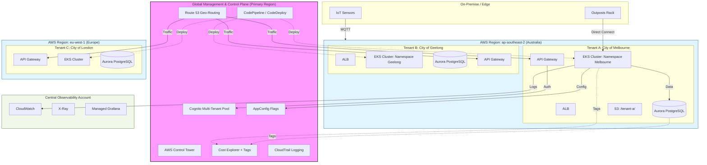

# Architecture Overview

This document outlines the proposed architecture for the Geospatial Traffic Management Platform.
It acts as a textual representation of the system to be verified against `overall_traific_aws_architecture.png`.

## High-Level Architecture

The platform is designed to be a scalable, reproducible AWS environment for ingesting, processing, and serving geospatial traffic data.

### Core Components

1.  **VPC (Virtual Private Cloud)**
    - Secure network isolation with Public and Private subnets across multiple Availability Zones.
    - [Internet Gateway](terraform/vpc.tf) for public access (ALB).
    - [NAT Gateway](terraform/vpc.tf) (one instance) for private subnets to access the internet.

2.  **Compute Layer**
    - **EKS (Elastic Kubernetes Service)**: Version 1.29 cluster ([eks.tf](terraform/eks.tf)) orchestrating `t3.medium` worker nodes in private subnets.
    - **Node Groups**: Managed node groups with auto-scaling (1-3 nodes).

3.  **Data Storage**
    - **RDS (Relational Database Service)**: PostgreSQL 16.1 instance ([rds.tf](terraform/rds.tf)) using `db.t3.medium` and `gp3` storage.
    - **PostGIS**: Provisioned within RDS for geospatial processing.
    - **S3 Data Lake**: Versioned and encrypted bucket ([s3.tf](terraform/s3.tf)) for raw logs and historical data.

4.  **Traffic Management**
    - **Application Load Balancer (ALB)**: Integrated via EKS AWS Load Balancer Controller to handle ingress traffic.

## Architecture Diagram

## Implementation Details & Verification
- **Alignment**: This documentation matches the current Terraform configuration in the `terraform/` directory.
- **Security**: RDS is isolated in private subnets with a security group allowing ingress only from the VPC CIDR (port 5432).
- **Public Access**: EKS endpoint is publicly accessible for administration, while worker nodes remain in private subnets.
- **Storage**: S3 bucket includes public access blocks and server-side encryption (AES256).
