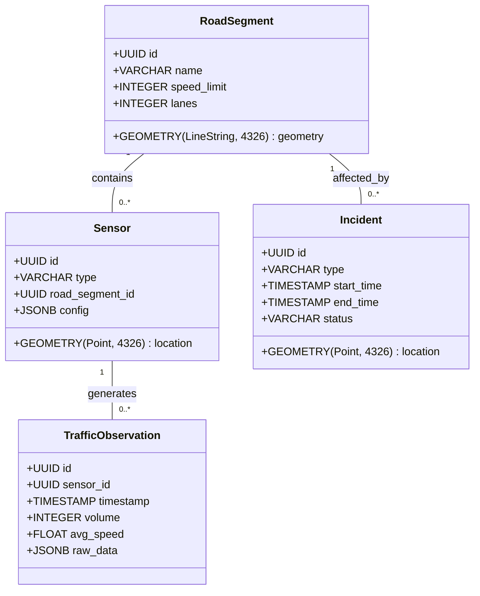

# Data Model

This document defines the data schema for the Traific Management Platform, utilizing PostGIS for geospatial representations.

## Entity Relationship Diagram

## Tables

### 1. RoadSegment
Represents the physical road network.
- **geometry**: Stores the path of the road as a LineString in WGS84 coordinates.

### 2. Sensor
IOT devices installed on the road network (Cameras, Inductive Loops, Bluetooth Sniffers).
- **location**: Precise GPS location of the device.

### 3. TrafficObservation
Time-series data generated by sensors.
- **volume**: Number of vehicles.
- **avg_speed**: Average speed in km/h.

### 4. Incident
Accidents, roadworks, or other events impacting traffic flow.
