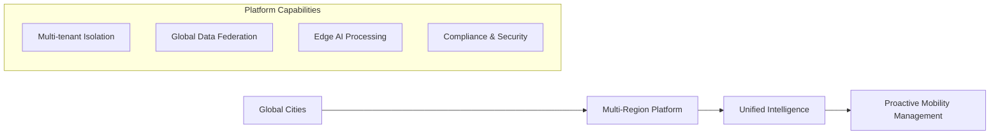
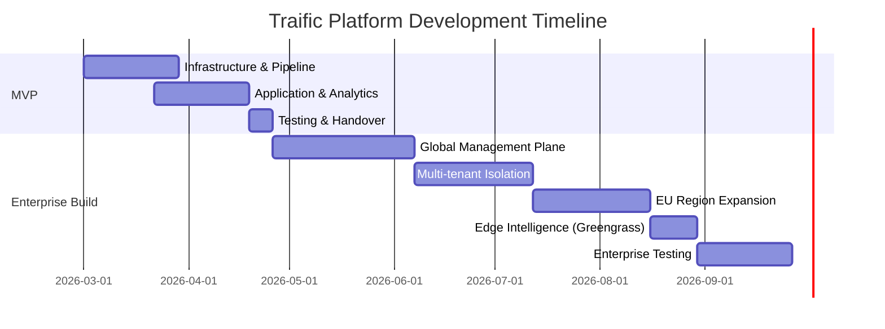

# Traific Platform: Investment Proposal

## Slide 1: Title Slide
**Traffic Intelligence Platform**
**Strategic Investment Proposal**

*Accelerating Urban Mobility Through Data Intelligence*
*Presented to: Review Board | Date: [Date]*

---

## Slide 2: The Challenge & Opportunity
**Urban Mobility Demands Smarter Solutions**

### Current State vs. Future State
| Aspect | Today | With Traific |
|--------|-------|-------------|
| **Data Visibility** | Siloed across departments | Unified real-time platform |
| **Incident Response** | Manual (hours) | Automated alerts (seconds) |
| **Coverage** | Single intersections | City-wide intelligence |
| **Analytics** | Historical reports | Predictive insights |
| **Scalability** | Custom per city | Multi-tenant SaaS |

### Market Opportunity
- 70% global population in cities by 2050 (UN)
- $800B annual congestion cost in US alone (Texas A&M)
- Smart city market to reach $2.5T by 2025 (Grand View Research)
- **15-30% congestion reduction** achievable with intelligent traffic management

---

## Slide 3: MVP: Our First Deliverable (6-8 Weeks)
**Prove the Core Value Proposition**

### MVP Scope (Single Tenant, AU Region)
- **Target Tenant**: City of Melbourne pilot
- **Core Capability**: End-to-end "Sensor to Insight" pipeline
- **Key Metrics**: <5s data latency, 99.5% API availability

### Architecture Snapshot
```
[Simple Architecture Diagram Showing]
IoT Sensors → AWS IoT Core → EKS Processing → RDS PostGIS → API Dashboard
                    ↓
               S3 Data Lake (Historical Analytics)
```

### MVP Deliverables
1. ✅ Working data pipeline (10K sensors simulated)
2. ✅ Real-time dashboard with geospatial visualization  
3. ✅ REST API for data access
4. ✅ Basic analytics (peak hour detection, trend analysis)
5. ✅ Documentation & operational runbooks

---

## Slide 4: Full Platform Vision
**Enterprise-Grade, Multi-Region Platform**

### Target Architecture


### Business Impact
- **For Cities**: 15-30% congestion reduction potential
- **For Citizens**: Improved commute times, safety, air quality
- **For Us**: Recurring SaaS revenue, data insights business

---

## Slide 5: Investment Roadmap
**Phased Delivery with Clear Decision Gates**

### Timeline & Investment Summary
| Phase | Timeline | Team Effort | AWS Cost* | Hardware | Key Deliverable |
|-------|----------|-------------|-----------|----------|-----------------|
| **MVP** | 6-8 weeks | 3.5 FTE | $4,000/mo | - | Proof of Value |
| **Phase 1** | 5-7 weeks | +1 FTE | +$3,000/mo | - | Enterprise Foundation |
| **Phase 2** | 5-6 weeks | +0.5 FTE | +$4,000/mo | - | Multi-tenant Scale |
| **Phase 3** | 4-6 weeks | +0.5 FTE | +$7,000/mo | - | Global Reach |
| **Phase 4** | 2-3 weeks | +1 FTE | +$2,000/mo | $5K-$15K | Edge Intelligence (IoT Greengrass) |
| **Total** | **25-32 weeks** | **6.5 FTE** | **$20K/mo at scale** | Variable | Enterprise Platform |

*Note: Costs scale with tenant adoption. MVP represents baseline.*

### Decision Gates
```
Phase Completion → 2-Week Review → Go/No-Go Decision → Next Phase
```

---

## Slide 6: Resource & Cost Breakdown
**Prudent Investment with Scalable Returns**

### Team Composition
| Role | MVP | Full Build-out | Responsibility |
|------|-----|----------------|----------------|
| Senior DevOps | 2 | 2 | Infrastructure & Security |
| Backend Engineer | 1 | 2 | API & Data Pipeline |
| Data Engineer | 0.5 | 1 | Analytics & ML |
| SRE | - | 1 | Platform Reliability |
| **Total FTE** | **3.5** | **6** | |

### Financial Projection (Year 1)
```
Quarter 1: MVP Development ($120K dev + $12K AWS)
Quarter 2: Platform Build ($180K dev + $24K AWS + $20K hardware)
Quarter 3: Launch & Scale ($240K dev + $40K AWS + ops)
Quarter 4: Growth Phase ($300K + revenue offset)
```

**Total Year 1 Investment: $840K - $950K**

### Return Metrics
- **Time to First Revenue**: Q3 (pilot city conversion)
- **Breakeven**: 3-5 cities at enterprise tier
- **Scale Potential**: $100K-500K ARR per major city

---

## Slide 7: Risk Management Strategy
**Proactive Mitigation for Key Challenges**

### Technical Risks & Mitigations
| Risk | Probability | Impact | Mitigation Strategy |
|------|------------|--------|-------------------|
| Edge Device Delays | Medium | Medium | Use cloud simulation initially; pre-order critical hardware |
| Multi-region Complexity | High | High | Validate in single region first; use experienced AWS architects |
| Sensor Integration | Medium | Medium | Standardize on MQTT; create adapter framework |
| Performance at Scale | Medium | High | Load test early; implement auto-scaling from day one |

### Business Risks
1. **Market Adoption**: Start with engaged pilot city (Melbourne confirmed interest)
2. **Competition**: Differentiate with geospatial focus and edge intelligence
3. **Regulatory Changes**: Design for GDPR/Privacy Act compliance from architecture

### Risk Reserve
- **Timeline Buffer**: 20% contingency built into estimates
- **Budget Buffer**: 15% contingency for unforeseen costs
- **Exit Options**: Each phase delivers standalone value

---

## Slide 8: Success Metrics & Validation
**How We'll Measure Progress**

### MVP Success Criteria (Go/No-Go for Phase 2)
- [ ] **Technical**: <5s end-to-end latency with 10K simulated sensors
- [ ] **Usability**: Dashboard delivers actionable insights per user testing
- [ ] **Stability**: 99.5% uptime over 2-week stress test
- [ ] **Stakeholder**: City of Melbourne team validates utility

### Platform Success Metrics
| Metric | Target | Measurement |
|--------|--------|-------------|
| Data Ingestion Rate | 100K events/sec | CloudWatch metrics |
| Tenant Onboarding | <48 hours | Automation testing |
| Cross-region Latency | <200ms | Global load testing |
| Cost per Tenant | <$1K/mo at scale | Cost Explorer reports |
| Incident Detection | <60 seconds | End-to-end timing |

### Validation Approach
1. **Weekly Demos** to stakeholder team
2. **Fortnightly Architecture Reviews** with AWS Solutions Architect
3. **Monthly Business Review** with leadership
4. **Formal UAT** at each phase completion

---

## Slide 9: Why This Approach Wins
**Balanced Strategy for Maximum Impact**

### Competitive Landscape
| Feature | **Traific** | Legacy Vendor A | SaaS Startup B |
|---------|-------------|-----------------|----------------|
| **Time to Deploy** | 6-8 weeks | 6-12 months | 3-4 months |
| **Geospatial Native** | ✅ PostGIS | ❌ Basic mapping | Partial (3rd party) |
| **Multi-tenant** | ✅ From day 1 | Limited | ❌ Single tenant |
| **Edge Processing** | ✅ IoT Greengrass | ❌ Cloud only | ❌ Cloud only |
| **Cost Model** | Scalable SaaS | High CapEx | Per-sensor pricing |
| **Global Ready** | ✅ Multi-region | Single region | US/EU only |

### Our Differentiators
- ✅ **Speed**: MVP in 6-8 weeks vs. market average 6+ months
- ✅ **Geospatial First**: Native PostGIS integration for location intelligence
- ✅ **Edge-Cloud Hybrid**: Real-time processing where data originates  
- ✅ **Compliance Ready**: GDPR/Privacy Act designed-in from architecture

### Team Readiness
- AWS Certified architects on team
- Terraform/IaC expertise proven
- Academic partnership (Prof. Majid, University of Melbourne)

---

## Slide 10: Request & Next Steps
**Seeking Strategic Partnership**

### What We're Asking For
1. **Approval** to proceed with MVP phase ($140K-$160K investment)
2. **AWS Credits** support for development environment
3. **Steering Committee** participation for phase reviews
4. **Intent** to fund subsequent phases pending MVP success

### If Approved: Immediate Next Steps
1. **Week 1-2**: Infrastructure foundation (Terraform deployment)
2. **Week 3-4**: Data ingestion pipeline (IoT Core → Kinesis → EKS)
3. **Week 5-7**: Core application development (FastAPI + PostGIS schema)
4. **Week 6-8**: Analytics & dashboard (geospatial visualization)
5. **Week 8**: Testing, documentation, stakeholder demo

### Decision Timeline Requested
- **Board Decision**: By [Date + 1 week]
- **MVP Start**: [Date + 2 weeks]
- **MVP Completion**: [Date + 8-10 weeks]
- **Phase 2 Decision**: [Date + 10-12 weeks]

---

## Slide 11: Appendix: Detailed Timeline
**Phase-by-Phase Breakdown**

### MVP (6-8 Weeks)
```
Week 1-2: Foundation Infrastructure (Terraform, EKS, RDS)
Week 3-4: Data Ingestion Pipeline (IoT Core, Kinesis)  
Week 5-7: Core Application (FastAPI, PostGIS schema, CRUD APIs)
Week 6-8: Analytics & Dashboard (CloudWatch, geospatial viz)
Week 8: Testing & Handover
```

### Full Platform (25-32 Weeks Total)


---

## Slide 12: Q&A
**Thank You**

**Contact:**
- Technical Lead: [Name]
- Product Lead: [Name]  
- Cloud Architect: [Name]

**Documentation Available:**
- Detailed Architecture Specification
- Risk Register & Mitigation Plans
- Cost Model & Scenarios
- Team Capability Statements

*We're ready to build the future of urban mobility, together.*